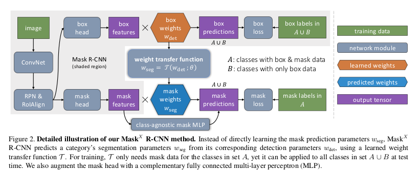

# PyTorch-mask-x-rcnn
PyTorch implementation of the Mask-X-RCNN network proposed in the 'Learning to Segment Everything' paper by Facebook AI Research.

## Introduction

The paper is about Instance Segmentation given a huge dataset with only bounding box and a small dataset with both bbox and segmentation ground truths. It follows the semi-supervised learning paradigm. The base architecture is same as that of Mask-RCNN. 

## Model Architecture

- The pipeline is as shown in the Figure. For little more explanation checkout this [blog post](https://skrish13.github.io/articles/2018-03/fair-cv-saga) (last section).
- Backproping both losses will induce a discrepancy in the weights of $$w_{seg}$$ as for common classes between COCO and VG there are two losses (bbox and mask) while for rest classes its only one (bbox). There's a fix for this
  - Fix: When back-propping the mask, compute the gradient of predicted mask weights ($$w_{seg}$$) wrt **weight transfer function** parameters $$\theta$$ but not bounding box weight $$w_{det}^c$$ . 
  - $$w^c_{seg} = \tau($$stop_grad$$(w^c_{det});\theta)$$  where $$\tau$$ predicted mask weights.



## Implementation Details

- The model is based on the Mask-RCNN implementation from [here](https://github.com/soeaver/Pytorch_Mask_RCNN). Thanks to him and original [Keras version](https://github.com/matterport/Mask_RCNN) on which its based on! Integrate it with the pipeline from the repo to train the network!
- Modules added 
  - `transfer_function` in `fpn_classifier_graph`
  - `cls` , `box` , `cls+box` choices for the detection weights in `fpn_classifier_graph`
  - `class-agnostic` (baseline) and `transfer` (above diagram) modes for the Mask branch as explained in the paper.
  - Optional `MLP fusion` (class agnostic MLP) as explained in Section 3.4 of the paper.
  - `stop_grad` for backpropping mask loss (keeping $$w_{det}$$ out of gradient calculation)


## Results

- I'm planning to run it on VOC+COCO soon. Will update once it's done.

## References

```
Hu, Ronghang, Piotr Dollár, Kaiming He, Trevor Darrell and Ross B. Girshick. “Learning to Segment Every Thing.” *CoRR*abs/1711.10370 (2017): n. pag.
```

